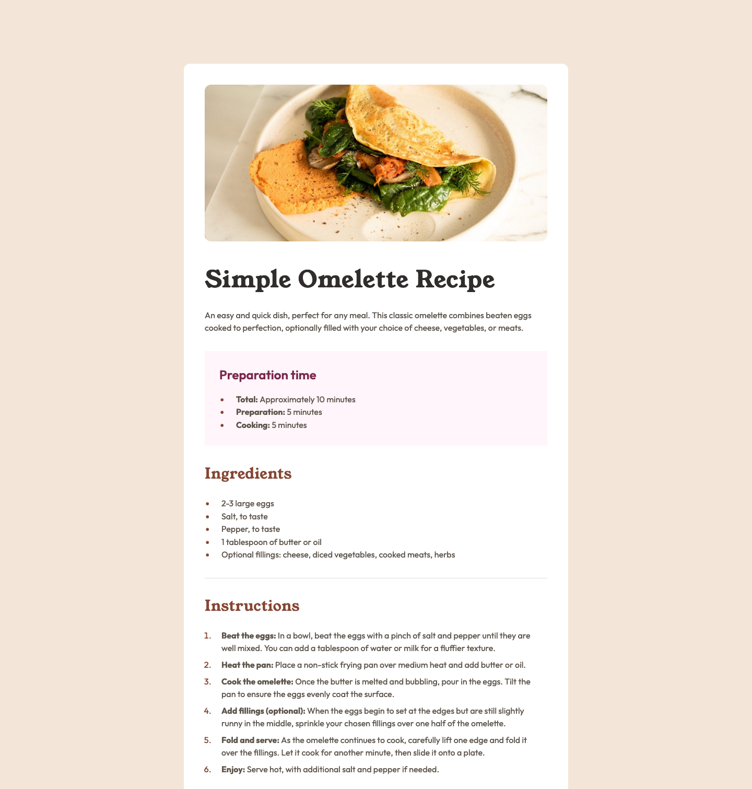

# Frontend Mentor - Recipe page solution

This is a solution to the [Recipe page challenge on Frontend Mentor](https://www.frontendmentor.io/challenges/recipe-page-KiTsR8QQKm). Frontend Mentor challenges help you improve your coding skills by building realistic projects. 

## Table of contents

- [Overview](#overview)
  - [The challenge](#the-challenge)
  - [Screenshot](#screenshot)
  - [Links](#links)
- [My process](#my-process)
  - [Built with](#built-with)
  - [What I learned](#what-i-learned)
  - [Continued development](#continued-development)
- [Author](#author)


## Overview

### Screenshots



[Mobile](assets/images/mobile.png)

### Links

- Solution URL: [Add solution URL here](https://your-solution-url.com)
- Live Site URL: [live site URL here](https://omelete-recipe-page.netlify.app/)

## My process

### Built with

- Semantic HTML5 markup
- CSS custom properties
- CSS Grid

### What I learned

When I took the recipe challenge, I decided to use CSS custom properties. They were straightforward and easy to learn. I did a quick Google search and followed the steps. What I like most about CSS custom properties is that using them forced me to be organized from the beginning, and it made adding styles to the project more fluid.

```css
/* Colors */
  --primary-nutmeg: hsl(14, 45%, 36%);
  --primary-dark-raspberry: hsl(332, 51%, 32%);
  --neutral-white: hsl(0, 0%, 100%);
  --neutral-rose-white: hsl(330, 100%, 98%);
  --neutral-eggshell: hsl(30, 54%, 90%);
  --neutral-light-grey: hsl(30, 18%, 87%);
  --neutral-wenge-brown: hsl(30, 10%, 34%);
  --neutral-dark-charcoal: hsl(24, 5%, 18%);

  /* Font Family */
  --font-family-young-serif: "Young Serif", serif;
  --font-family-outfit: "Outfit", sans-serif;

  /* Font weight */
  --font-weight-regular: 400;
  --font-weight-bold: 600;
  --font-weight-heavy: 700;
```

I also wanted to use CSS grid to simplify centering the page and adding responsiveness.  At first, I wasn't sure it was possible because my wrapper didn't seem to need rows and columns. However, a quick Google search revealed that it was indeed possible, and it made a huge difference in both centering and adding responsiveness to the project.

```css
.wrapper {
  display: grid;
  place-items: center;
  background-color: var(--neutral-eggshell);
}
```

Finally, I kept running into an issue where I needed to style or not style the last element of a group of elements. A Google search confirmed that this was possible, and it's one of those techniques that's going to stick with me.

```css
.recipe-instructions-list li:not(:last-child){
  margin-bottom: 0.5rem;
}
.recipe-instructions-list li:last-child {
  margin-bottom: 2rem;
}
```

### Continued development

I want to continue to develope in CSS grid and making sites responsive.

## Author

- Frontend Mentor - [@CalderonVasquez](https://www.frontendmentor.io/profile/CalderonVasquez)
